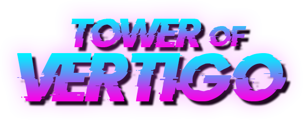

# Tower of Vertigo

Tower of Vertigo is a fast paced action game that mixes the platformer genre with fighting game mechanics. Players must clash in a life or death race with the objective  of capturing the orb at the top.
Each player must face the vertiginous map, its obstacles and their rival.
Only the player that masters combat and map mobility will achieve victory. 

This is a game (still in development) developed by students from <a href="https://www.imagecampus.edu.ar/">Image Campus</a>

   

## Credits

- **Iker Noya** - *Programming*
- **Franco Zeromski** - *Character Artist*
- **Isidro Santos Ortega** - *Level Artist*
- **Alan Briz** - *UI Artist*
- **Fernando Alonso** - *Audio*
- **Dante Delli Carpini** - *Audio*
- **Ezequiel Martinez** - *Audio*
- **Israel Muchnick** - *Audio*
- **León Heredia** - *Testing*
- **Eric Luna** - *Testing*
- **Florencia Silva** - *Testing*

This game was also possible thanks to the support of these professors:

- **Sergio Baretto**
- **Federico Barra**
- **Jorge Cuéllar**
- **Fernando Puig**
- **Eugenio Taboada**

## Links

Download it from itch.io: https://ikernoya.itch.io/tower-of-vertigo
